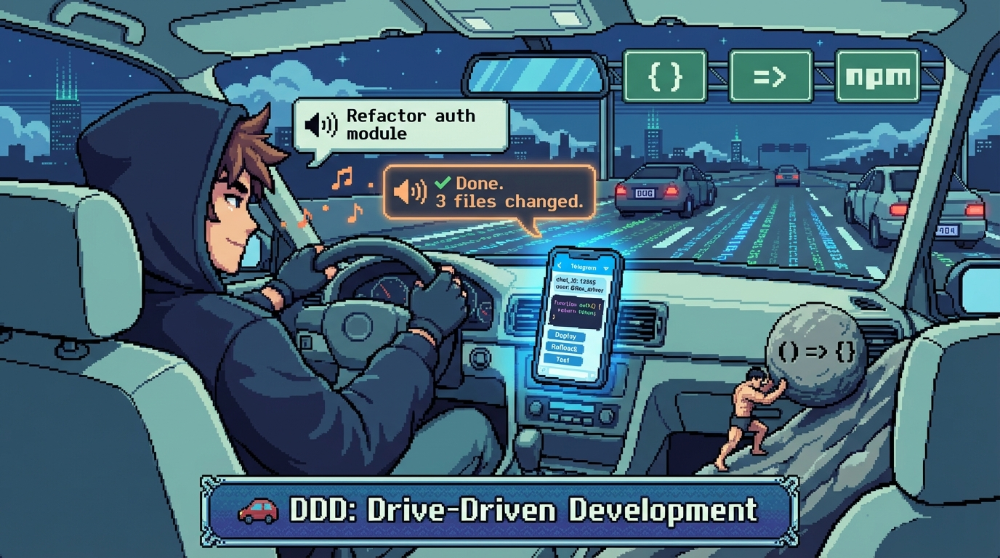

[한국어](README-kr.md)

# Claude-Go

**Control Claude Code remotely — right from your phone.**

[](LICENSE)
[](https://bun.sh)
[](https://www.typescriptlang.org/)

<div align="center">
<br>


### TDD: Toilet-Driven Development

*Telegram-Driven Development, Toilet-Driven Development — call it whatever you want.*
*Your AI agent keeps working even while you're on the throne.* 🚽

</div>

<div align="center">
<br>


### DDD: Drive-Driven Development

*"Run the tests and fix whatever fails." — You didn't type that. You said it.*
*Hands on the wheel, eyes on the road. Your AI heard you, and it's already pushing fixes.* 🚗

</div>

---

### Like Pokemon Go, but for coding

**Code from anywhere.** On a bus, at a park, waiting in line — wherever you are, your AI agent is ready.

For beginners, coding on a smartphone is painful: tiny terminal fonts, SSH clients, typos everywhere. **Claude-Go removes all that friction.** Just tap buttons, send messages, and let the AI handle the hard parts.

---

Control [Claude Code](https://docs.anthropic.com/en/docs/claude-code) running on your server via **Telegram**.
On your commute, at a cafe, in bed — command your AI to write code and get real-time results from anywhere.

```
📱 Telegram (from anywhere)
 ↕  Telegram Bot API
🤖 Claude-Go (Bun + TypeScript)
 ↕  Claude Agent SDK (in-process)
🗂️ Your Project
```

> [!IMPORTANT]
> **Claude-Go runs as a single process.** Unlike the previous OpenCode-based version,
> there is no separate server to start. Just run the bot and it handles everything.

> [!TIP]
> **Too lazy to read?** Just paste this README link to your AI agent. It'll handle the installation for you.
> ```
> Install and configure this project:
> https://raw.githubusercontent.com/reahbi/claude-go/master/docs/installation.md
> ```

---

## Table of Contents

- [Why Claude-Go?](#why-claude-go)
- [Key Features](#key-features)
- [Quick Start](#quick-start)
- [Installation](#installation)
- [Commands](#commands)
- [Environment Variables](#environment-variables)
- [Architecture](#architecture)
- [Deployment](#deployment)
- [Troubleshooting](#troubleshooting)
- [Documentation](#documentation)
- [License](#license)

---

## Why Claude-Go?

**The Problem**: AI coding agents (like Claude Code) are powerful, but you need to be sitting in front of the server.
Got an idea while commuting? You'll have to wait until you get home.

**The Solution**: Claude-Go bridges Telegram and Claude Code.

| Other Tools | Claude-Go |
|---|---|
| SSH into server, navigate CLI | One Telegram message does it all |
| AI asks questions? Answer in terminal | Tap an inline button to respond |
| Scroll through long responses in terminal | Auto-summary + file delivery optimized for mobile |
| Single project only | Manage multiple projects with PM2 |
| "What was the AI doing?" — SSH back in, scroll logs | `/resume` → Instantly see ongoing work + real-time progress |
| Copy-paste terminal output to share | `/history` → Beautiful HTML export with syntax highlighting |

> At a cafe: "Refactor this file" → AI works on it → Done notification — That's Claude-Go.

### Start a task. Walk away. Come back anytime.

```
🚶 You: "Refactor auth module" → Close phone → Go to lunch
🍜 30 minutes later...
📱 You: /resume → See AI still working, done
💻 Back at your desk: /resume → Continue where you left off
```

**Your AI keeps working. You don't have to watch.**

### Get conversation history without entering a session

```
📋 /list → See all sessions → Tap one → Get full history as HTML
📄 /history → Export current session as beautifully formatted HTML
```

**Review any past session on your phone, tablet, or computer — no SSH required.**

---

## Key Features

**Real-time Streaming** — Live text streaming as Claude thinks and writes. See responses appear character by character.

**Extended Thinking** — Trigger deep analysis with keywords like "think", "analyze", or "deep". Claude shows its reasoning process.

**Smart Delivery** — Short responses inline, long responses auto-chunked, very long responses sent as `.md` files.

**Response Summary** — Long AI responses are automatically summarized by a lightweight model. Quickly grasp the key points on mobile. Summary style adapts to your expertise level.

**Cost Tracking** — See token usage and cost after each response. Track spending per session.

**Agent Switching** — Use `/agents` to select the right AI model for the situation.

**Multi-Instance** — Manage multiple projects as separate bots simultaneously using PM2.

**Group Chat** — Add multiple bots to a Telegram group and control each via @mentions.

**Multi-Bot Collaboration** — Separate Writer (code writing) and Reader (code review) roles. Use `/debate` for discussions and `/review` for code reviews.

**Group Shared Settings** — Use `/groupsettings` to view shared settings (debate rounds) and bot status at a glance.

**Bot Registry** — Check registered bot status with `/bots`, add new bots with `/addbot` in Telegram.

**Review Mode** — Toggle read-only mode with a single tap in `/settings`. Applies instantly without restart.

**Session Resume** — Use `/resume` to jump back into a previous session. Automatically detects ongoing work and shows real-time progress.

**Beautiful History Export** — Export your conversation history as a beautifully formatted HTML file with `/history`.

**Image Support** — Send photos directly from your phone. Screenshots of error messages, UI mockups, diagrams — the AI analyzes them natively via Claude's vision API.

**Voice Input** — Send voice messages and they're automatically transcribed via Whisper and sent to Claude. (Requires OpenAI API key)

**Voice Response** — Listen to AI summaries instead of reading. Auto-voice mode sends MP3 automatically. Uses Edge TTS with Korean/English voices.

**Expertise Level** — Tailor both text summaries and voice responses to your skill level. Choose from three modes in `/settings`:
- **Vibe Coder** — No jargon. Explains what changed from your perspective.
- **Developer** — Full technical detail: file names, function signatures, architecture reasoning.
- **Beginner** — Technical terms with brief explanations. Helps you learn while you build.

**Git Status (`/git`)** — Quick git overview with branch, status, and recent commits.

**Inactivity Warning** — Get notified if your AI session sits idle for 30+ minutes.

**Hook Bot** — A separate lightweight process that monitors Claude sessions and sends Telegram notifications. Get notified when sessions complete, stall, or encounter errors. Set up with `/addhookbot`.

**Budget Control** — Set maximum spend per session via `MAX_BUDGET_USD` environment variable.

**Diagnostics** — Run `bun run doctor` to auto-diagnose configuration issues.

---

## Quick Start

### Option 1: Let AI Handle It (Recommended)

Paste this into your AI agent (Claude Code, Cursor, etc.):

```
Install and configure Claude-Go:
https://raw.githubusercontent.com/reahbi/claude-go/master/docs/installation.md
```

The AI will ask a few questions and handle the rest automatically.

### Option 2: Manual Installation

```bash
git clone https://github.com/reahbi/claude-go.git
cd claude-go
bun install
bun run setup    # Interactive setup wizard
bun run start    # Start the bot
```

### Prerequisites

- [Bun](https://bun.sh) v1.0 or higher
- [Claude Code](https://docs.anthropic.com/en/docs/claude-code) CLI installed and authenticated
- Telegram bot token from [@BotFather](https://t.me/BotFather)

### First Use

1. Send `/start` to your bot on Telegram
2. Create a new AI session with `/new`
3. Send a message — it goes straight to Claude

---

## Installation

### Manual Setup

```bash
cp .env.example .env
```

Open the `.env` file and set the required values:

```bash
BOT_TOKEN=your-bot-token-here          # From @BotFather
ALLOWED_USER_IDS=123456789             # Your Telegram User ID
DEFAULT_PROJECT=/path/to/your/project  # Project path (absolute path)
```

> [!TIP]
> Use `bun run setup` to complete the configuration interactively.

> [!WARNING]
> Always verify your configuration with `bun run doctor`.

---

## Commands

| Command | Description |
|---|---|
| `/start` | Onboarding + status check |
| `/new [title]` | Create new AI session |
| `/list` | View session list |
| `/resume [number]` | Resume a session |
| `/abort` | Stop current operation |
| `/history` | Export session history |
| `/queue [msg]` | Queue message while AI is busy |
| `/clearqueue` | Clear queued messages |
| `/showqueue` | Show queue status |
| `/undo` | Undo last AI response |
| `/redo` | Redo undone response |
| `/status` | Check current status |
| `/git` | Git status, diff, log |
| `/agents` | Select AI agent/model |
| `/settings` | Summary mode, Review Mode, Voice, output format, etc. |
| `/groupsettings` | Group shared settings (debate rounds, bot status) |
| `/debate [topic]` | Start Writer↔Reader bot debate |
| `/review [target]` | Request code review from peer bot |
| `/bots` | Registered bot status (online/offline) |
| `/addbot` | New bot setup wizard (DM only) |
| `/addhookbot` | Hook bot setup wizard (DM only) |
| `/cancel` | Cancel ongoing wizard |
| `/help` | Help |

Regular text messages are sent as prompts to the current session's AI.

---

## Environment Variables

| Variable | Required | Default | Description |
|---|:---:|---|---|
| `BOT_TOKEN` | Yes | — | @BotFather bot token |
| `ALLOWED_USER_IDS` | Yes | — | Allowed Telegram User IDs (comma-separated) |
| `DEFAULT_PROJECT` | Yes | — | Default project directory (absolute path) |
| `CLAUDE_MODEL` | | `claude-sonnet-4-5` | Claude model ID |
| `CLAUDE_CODE_PATH` | | (auto-detect) | Path to Claude Code executable |
| `MAX_THINKING_TOKENS` | | `0` | Extended Thinking token limit (0 = disabled) |
| `MAX_BUDGET_USD` | | — | Max budget per session in USD |
| `OPENAI_API_KEY` | | — | OpenAI API key for Whisper voice-to-text |
| `INSTANCE_NAME` | | Project dir name | Instance identifier |
| `STATE_DIR` | | `data/` | State file storage path |
| `BOT_ROLE` | | `standalone` | Bot role: `standalone`, `writer`, `reader` |
| `GROUP_CHAT_ENABLED` | | `false` | Group chat support |
| `COORDINATION_DIR` | | — | Shared directory for bot coordination (required for multi-bot) |
| `DEFAULT_AGENT` | | — | Default AI agent name |
| `DEFAULT_CUSTOM_AGENT` | | — | Default custom agent ID (from `/makeagent`) |
| `HOOK_CONFIG_PATH` | | `data/hook-config.json` | Hook bot configuration file path |
| `DEBUG` | | — | Enable debug logs |

---

## Architecture

Built on **Clean Architecture (Hexagonal / Ports & Adapters)**.

```
src/
├── domain/        # Pure types + ports — ZERO external dependencies
├── app/           # Use cases — imports domain/ only
├── adapters/      # External world — Telegram, Claude Agent SDK, JSON storage
├── config/        # Environment parsing + project settings
├── shared/        # Logger, formatters, constants
├── main.ts        # Composition Root (dependency assembly)
└── hookBot.ts     # Hook Bot Composition Root (session notification process)
```

**Single-Process Architecture:**

```
📱 Telegram
 ↕  Telegram Bot API
🤖 Claude-Go Bot (Bun + TypeScript)
 ├── grammy (Telegram framework)
 ├── Claude Agent SDK (in-process, query() AsyncGenerator)
 ├── Session Store (JSON-based, local)
 └── Summary Service (Claude CLI subprocess)
 ↕
🗂️ Your Project
```

**Multi-Bot Mode:**

```
📱 Telegram Group
 ↕  @mention routing
🤖 Writer Bot ←──coordination──→ 🤖 Reader Bot
 ↕  Agent SDK                     ↕  Agent SDK
🗂️ Project                       🗂️ Project
     └── registry.json (shared) ──┘
```

**Core Dependency Rule**: `domain/` → imports nothing | `app/` → `domain/` only | `adapters/` → `app/` + `domain/`

**Tech Stack**: Bun + TypeScript (strict) + [grammy](https://grammy.dev) + [@anthropic-ai/claude-agent-sdk](https://www.npmjs.com/package/@anthropic-ai/claude-agent-sdk)

> When AI agents modify this project, refer to [AGENTS.md](AGENTS.md).
> Contains code map, conventions, and anti-patterns.

---

## Deployment

### Single Bot

```bash
bun run start    # Production mode
```

### Multi-Bot with PM2

```js
// ecosystem.config.cjs
const COORDINATION_DIR = '/tmp/claude-go-coordination'

module.exports = {
  apps: [
    {
      name: 'claude-go-writer',
      script: 'src/main.ts',
      interpreter: 'bun',
      env: {
        BOT_TOKEN: 'writer-bot-token',
        ALLOWED_USER_IDS: 'your-user-id',
        DEFAULT_PROJECT: '/path/to/project',
        INSTANCE_NAME: 'writer',
        STATE_DIR: 'data/instances/writer',
        BOT_ROLE: 'writer',
        GROUP_CHAT_ENABLED: 'true',
        COORDINATION_DIR,
      },
    },
    {
      name: 'claude-go-reader',
      script: 'src/main.ts',
      interpreter: 'bun',
      env: {
        BOT_TOKEN: 'reader-bot-token',
        ALLOWED_USER_IDS: 'your-user-id',
        DEFAULT_PROJECT: '/path/to/project',
        INSTANCE_NAME: 'reader',
        STATE_DIR: 'data/instances/reader',
        BOT_ROLE: 'reader',
        GROUP_CHAT_ENABLED: 'true',
        COORDINATION_DIR,
      },
    },
  ],
}
```

```bash
pm2 start ecosystem.config.cjs
pm2 logs
```

> [!TIP]
> You can also add bots via the `/addbot` command in Telegram.

---

## Troubleshooting

```bash
bun run doctor    # Auto-diagnoses configuration items
```

Common issues:
- **Claude Code not found**: Make sure `claude` CLI is installed and on your PATH, or set `CLAUDE_CODE_PATH`
- **Bot not responding**: Check `BOT_TOKEN` and `ALLOWED_USER_IDS` in `.env`
- **Session errors**: Try `/new` to create a fresh session

---

## Development

```bash
bun run dev        # Development mode (hot reload)
bun run hook       # Start hook bot (session notifications)
bun run typecheck  # Type check
bun run build      # Build to dist/
bun test           # Run tests
```

---

## Acknowledgments

This project was inspired by and built upon ideas from:

- [oh-my-opencode](https://github.com/code-yeongyu/oh-my-opencode) — Agent configuration and tooling inspiration
- [Kimaki](https://github.com/remorses/kimaki) — Implementation references and ideas
- [linuz90/claude-telegram-bot](https://github.com/linuz90/claude-telegram-bot) — Claude Agent SDK + grammy patterns

---

## License

MIT
